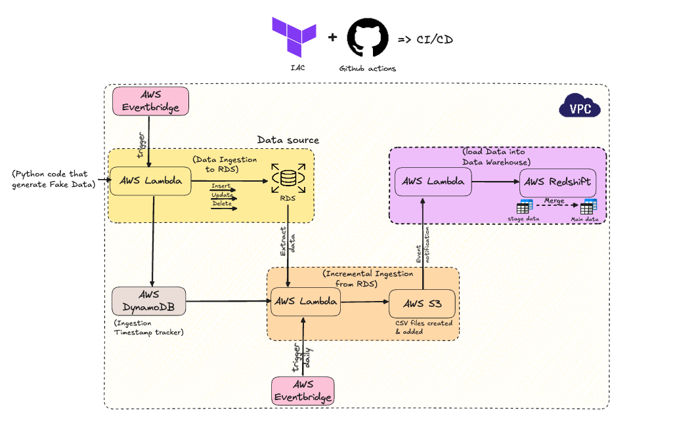

# aws_data_warehouse_pipeline

ARCHITECTURE

# Tech Stack
- Terraform 
- Github actions (CI/CD)
- AWS Lambda
- AWS Eventbridge
- Amazon S3
- AWS Redshift
- SQL
- Python

# Overwiew

In this project, I created a pipeline to build a data warehouse for SMEs. 

For more information, you can check this Meduim artcile
    - [How I Built an Effective Data Warehouse for SMEs](https://medium.com/data-engineer-things/how-i-built-an-effective-data-warehouse-for-smes-0fbc3272e0de)